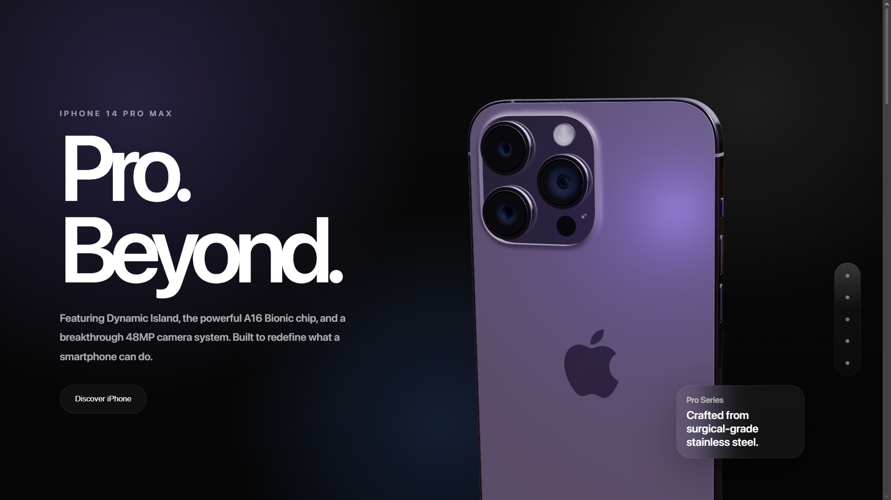
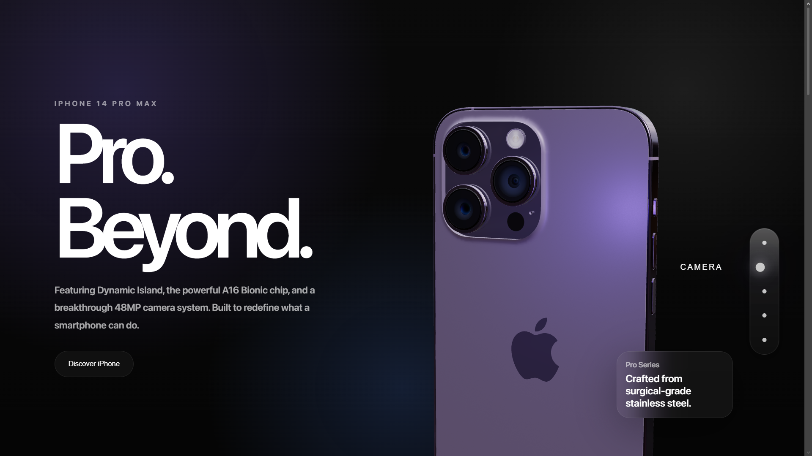
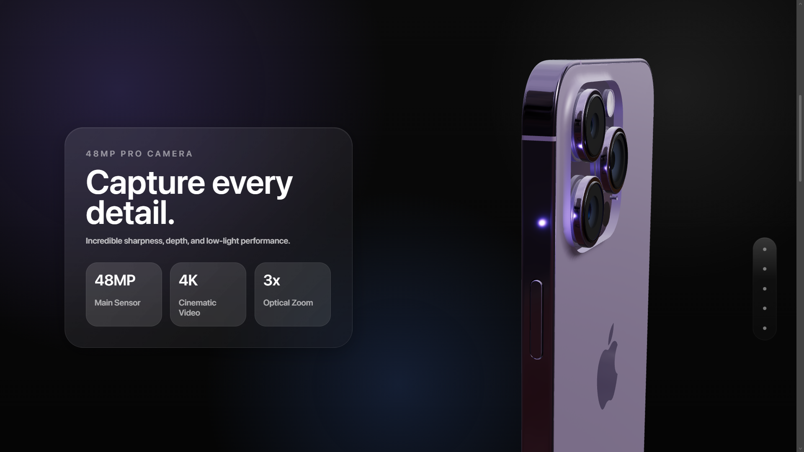
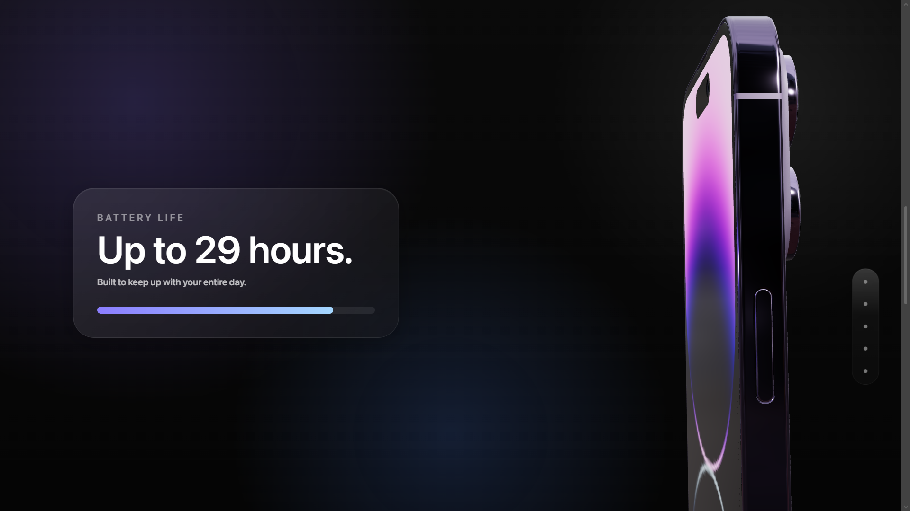
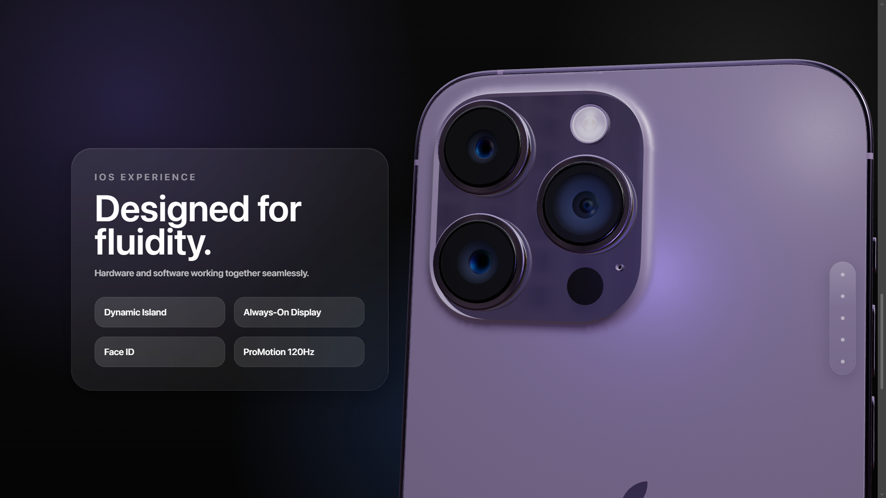
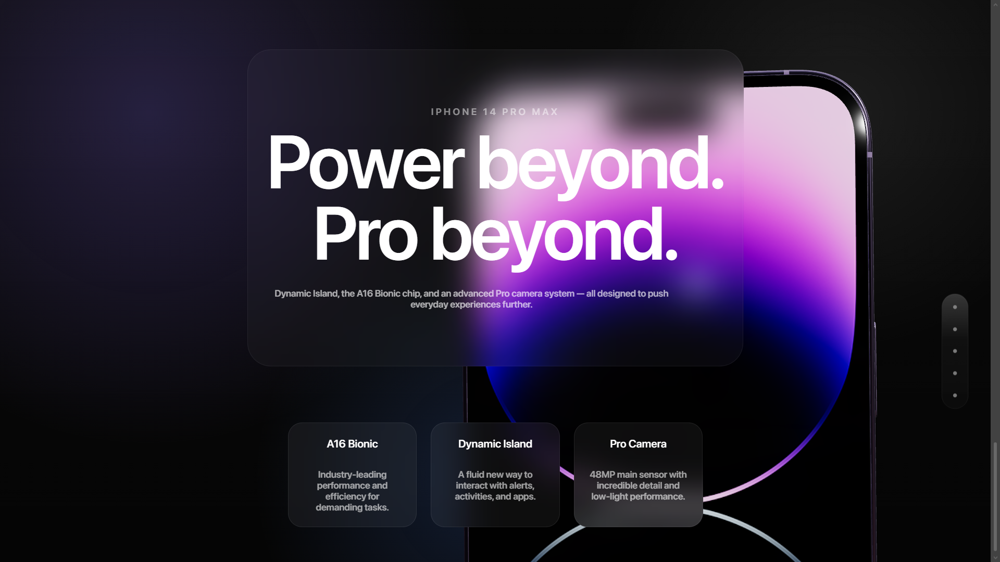
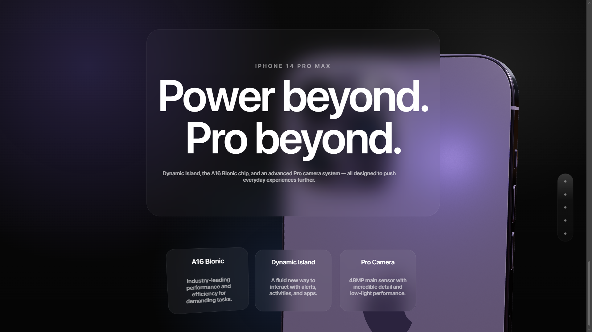

# 📱 iPhone 14 Pro Max Showcase

iPhone 14 Pro Max Showcase is an immersive product presentation experience inspired by Apple's keynote events and modern product landing pages. Built with React, Three.js, React Three Fiber, and Framer Motion, the project explores premium UI design through 3D visuals, glassmorphism, transparency, depth, and fluid motion.

The experience centers around a fully interactive 3D iPhone 14 Pro Max model that evolves throughout the page as users navigate between sections highlighting key product features, including the Pro camera system, battery performance, and advanced display technologies.

The project was created as a frontend development and UI/UX exploration, focusing on recreating the polished visual language often associated with Apple's ecosystem. Special attention was given to motion design, layered blur effects, spatial depth, and smooth interactions to deliver a refined and premium browsing experience.

The goal of this project is to demonstrate how modern web technologies can be combined to create engaging product showcases that blend storytelling, interaction, and visual sophistication.

---

## ✨ Features

* 📱 Interactive 3D iPhone 14 Pro Max model
* 🎥 Scroll-driven product storytelling experience
* ✨ Glassmorphism and liquid-glass inspired UI elements
* 🌫️ Layered transparency and blur effects
* 🎞️ Smooth animations and transitions powered by Framer Motion
* 🧭 Floating visionOS-inspired navigation system
* 📸 Dedicated camera showcase section
* 🔋 Battery and performance highlights
* 💡 Dynamic lighting and immersive depth effects
* 📐 Responsive layout optimized for desktop and modern devices
* 🎨 Apple-inspired visual design language

---

## 🧰 Tech Stack

* React
* React Three Fiber
* Three.js
* Framer Motion
* JavaScript (ES6+)
* HTML5
* CSS3
* Vite

---

## ⚙️ Notes

* This project was bootstrapped with Vite.
* Inspired by Apple's product presentations and design principles.
* Built as a UI/UX, motion design, and 3D web development exploration.
* Focused on frontend experiences rather than commercial product functionality.

---

## 🚀 Live Demo

👉 https://iphone-showcase-walterbarider.vercel.app

---

## 📸 Screenshots

### Hero Section





### Camera Experience




### Battery Section




### Features Section




### Showcase Section




---

## 📦 Installation

```bash
git clone https://github.com/walterbardier/iphone-showcase.git
cd iphone-showcase
npm install
npm run dev
```
